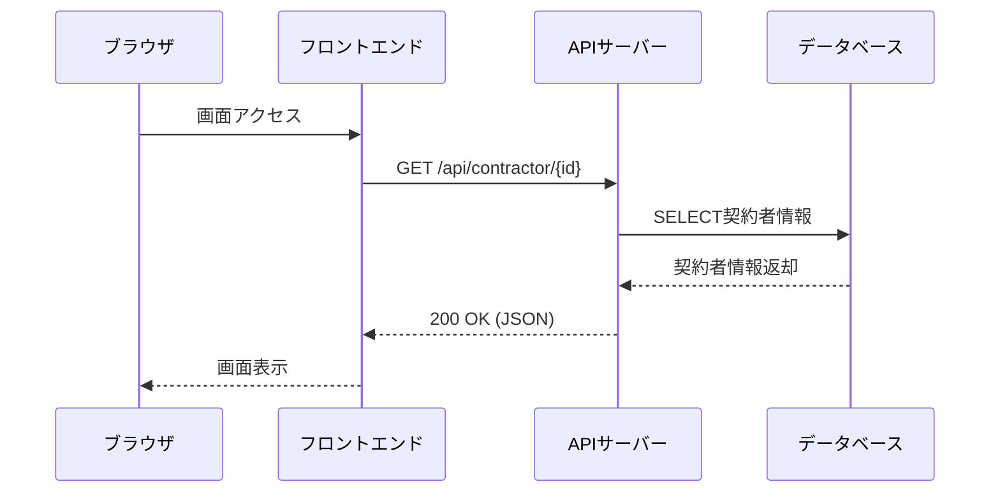
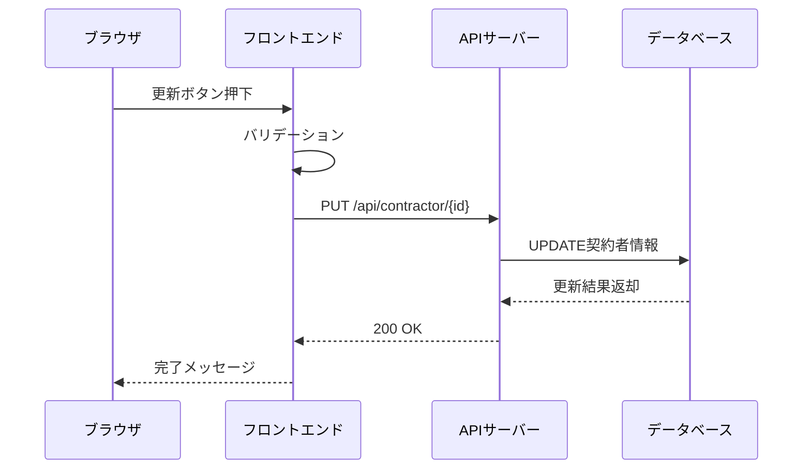

# 契約者情報モジュール- シーケンス図

## 概要

契約者情報の取得・更新に関するシーケンスを示す。

## 契約者情報取得シーケンス

```mermaid
sequenceDiagram
    participant Browser as ブラウザ
    participant Frontend as フロントエンド
    participant API as APIサーバー
    participant DB as データベース
    
    Browser->>Frontend: 画面アクセス
    Frontend->>API: GET /api/contractor/{id}
    API->>DB: SELECT契約者情報
    DB-->>API: 契約者情報返却
    API-->>Frontend: 200 OK (JSON)
    Frontend-->>Browser: 画面表示
```

## 契約者情報更新シーケンス

```mermaid
sequenceDiagram
    participant Browser as ブラウザ
    participant Frontend as フロントエンド
    participant API as APIサーバー
    participant DB as データベース
    
    Browser->>Frontend: 更新ボタン押下
    Frontend->>Frontend: バリデーション
    Frontend->>API: PUT /api/contractor/{id}
    API->>DB: UPDATE契約者情報
    DB-->>API: 更新結果返却
    API-->>Frontend: 200 OK
    Frontend-->>Browser: 完了メッセージ
```

## 補足事項

- 認証トークンは各リクエストの `Authorization` ヘッダーに付与する
- タイムアウトは 10秒 に設定する
